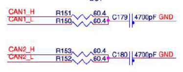

# NavQPlus


Also take a look at some of our other Gitbooks:

* [HoverGames](https://app.gitbook.com/o/-L9GLsni4p7csCR7QCJ8/s/-L9GLtb-Tz\_XaKbQu-Al/)
* [8M Mini NavQ](https://app.gitbook.com/o/-L9GLsni4p7csCR7QCJ8/s/-M-CCnxDe4dTvAz3QmDw/)
* [NXP Cup](https://app.gitbook.com/o/-L9GLsni4p7csCR7QCJ8/s/-L9GLtaxrQtBdBRsFIJB/)
* [UCANS32K146 UAVCAN/CAN Node](https://app.gitbook.com/o/-L9GLsni4p7csCR7QCJ8/s/-M7FJ\_hQKd8L0MNgduui/)



This gitbook is under construction.


## Introduction

The 8MPNAVQ or "NavQPlus" is a small purpose built Linux computer EVK based on the [NXP i.MX 8M Plus SOC](https://www.nxp.com/products/processors-and-microcontrollers/arm-processors/i-mx-applications-processors/i-mx-8-processors/i-mx-8m-plus-arm-cortex-a53-machine-learning-vision-multimedia-and-industrial-iot:IMX8MPLUS). It is focused on the common needs of Mobile Robotics systems.

The entire design is available for companies building their own similar hardware. NavQPlus is built as a stack of boards, the top board being a SOM (system on module) containing the Processor, memory and other components with strict layout requirements, and where the secondary boards are relatively inexpensive (often 4 layer boards) and allows for versions with customization to be easily built.

Note that the SOM is almost identical to the larger [NXP EVK for i.MX8M Plus](https://www.nxp.com/design/development-boards/i-mx-evaluation-and-development-boards/evaluation-kit-for-the-i-mx-8m-plus-applications-processor:8MPLUSLPD4-EVK) with the exception of the IO voltages being changed to 3.3V. This makes NavQPlus an excellent stepping stone or bridge from the large EVK to a system that can be duplicated for testing in-situ, or even copied directly for your application.&#x20;

\
Because NavQPlus is experimental and a new set of boards and peripherals, please expect and plan for software enablement to undergo several iterations. Our intent is to provide an Ubuntu POC (Proof of Concept) "friendly Linux" with typical packages and additional tools included rather than the traditional Yocto only distribution that is typical of highly optimized and stripped down Linux in deeply embedded products. Since this Ubuntu POC is built on top of Yocto it is still able to be reduced and optimized for full commercial deployment as well.\
\
It should be noted that Ubuntu POC is NOT supported by Canonical. They are however available on a contractual bases to provide commercial support for Ubuntu on NXP processors.

## Features

1. NXP i.MX 8M Plus SOC on a SOM with LPDDR4 DRAM and eMMC Flash.
   * 4x Arm Cortex-A53
   * 1x Arm Cortex-M7
   * 1x Neural Processing Unit (2.3 TOPS)
   * 1080p60 H.265/H.264 encoder
   * Dual Camera Image Signal Processor (HDR, Dewarp)
2. A secondary board with hardware interfaces such as:
   * Dual MIPI-CSI camera interfaces
   * Two CAN-FD interfaces
   * I2C, SPI, UART, GPIO
   * SD Card slot
   * 2.4/5GHz WiFi and Bluetooth 5.0 using NXP 88W8987 based [Murata Type 1ZM module](https://www.murata.com/products/connectivitymodule/wi-fi-bluetooth/overview/lineup/type1zm)&#x20;
   * Micro HDMI, MIPI-DSI, LVDS for displays
   * USB-C PWR in/out
   * 1Gb IX industrial Ethernet
   * JTAG BOOT

### Block Diagram

<figure><figcaption>
NavQPlus Block Diagram
</figcaption></figure>

## Applications

The NavQPlus is suitable for many purposes, including generic robots, various vision systems, and AI/ML applications.

The NavQPlus is suitable for many purposes, including generic robots and various vision systems.

* Drones, Multicopters, Unmanned Aircraft, VTOL
* Rovers
* Road going Delivery Vehicles
* Robotic Lawnmowers
* Robotic Vacuum
* Flying vehicles (PX4)
* DIYRobotCars
* Marine vessels
* Camera and Vision processing modules
* Time of Flight (TOF) Cameras
* AI/ML inference
* Cellular gateway
* Vision systems in other applications
  * e.g a hospital bed monitor that detects if a patient is sitting up or at risk of falling out of bed.

Two specific complete developer tool examples are the [NXP HoverGames Drone](https://nxp.gitbook.io/hovergames), and the NXP-CUP car.

## Software

The intent of the 8MPNavQ in HoverGames is to enable participants with a solution that allows them to harness common robotics packages and libraries such as:

* ROS/ROS2
* OpenCV
* GStreamer
* pyeIQ
  * TensorFlow/TFLite
  * PyTorch
  * ArmNN
  * etc
* And more!

The 8MPNavQ runs linux with a package manager, so you should be able to install the packages that you need to complete your projects successfully and efficiently.
