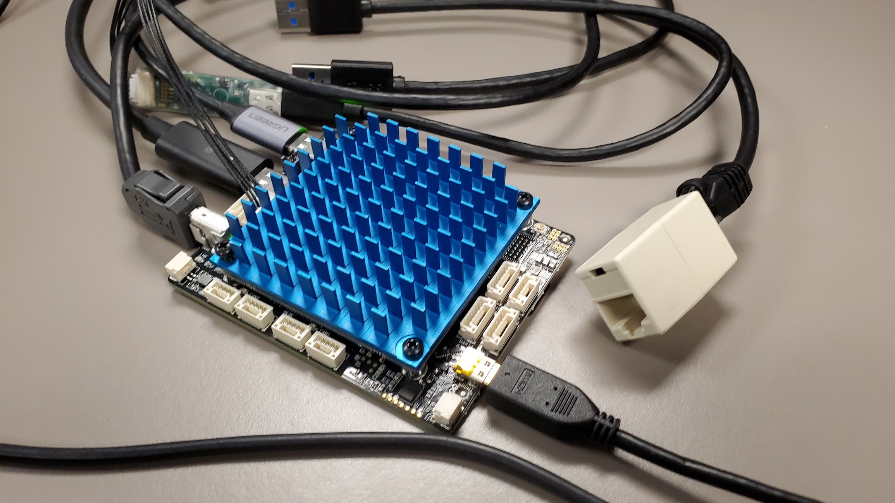

# NavQPlus


Also take a look at some of our other Gitbooks:

* [HoverGames](https://app.gitbook.com/o/-L9GLsni4p7csCR7QCJ8/s/-L9GLtb-Tz\_XaKbQu-Al/)
* [8M Mini NavQ](https://app.gitbook.com/o/-L9GLsni4p7csCR7QCJ8/s/-M-CCnxDe4dTvAz3QmDw/)
* [NXP Cup](https://app.gitbook.com/o/-L9GLsni4p7csCR7QCJ8/s/-L9GLtaxrQtBdBRsFIJB/)
* [UCANS32K146 UAVCAN/CAN Node](https://app.gitbook.com/o/-L9GLsni4p7csCR7QCJ8/s/-M7FJ\_hQKd8L0MNgduui/)



This gitbook is under construction.


The 8MPNavQ is a small purpose built experimental Linux computer based on the [NXP i.MX 8M Plus SOC](https://www.nxp.com/products/processors-and-microcontrollers/arm-processors/i-mx-applications-processors/i-mx-8-processors/i-mx-8m-plus-arm-cortex-a53-machine-learning-vision-multimedia-and-industrial-iot:IMX8MPLUS). It is focused on the common needs of Mobile Robotics systems.

The system is built as a stack of boards, the top board being a SOM (system on module) containing the Processor, memory and other components with strict layout requirements, and where the secondary boards are relatively inexpensive (often 4 layer boards) and allows for versions with customization to be easily built.\
This is a brand new set of boards and software enablement will undergo several iterations. Our intent is to provide a "friendly Linux" with typical packages and additional tools included rather than the typical highly optimized and stripped down Linux found in deeply embedded products.

The 8MMNavQ features:

1. NXP i.MX 8M Plus SOM with LPDDR4 DRAM and eMMC Flash.
   1. 4x Arm Cortex-A53
   2. 1x Arm Cortex-M7
   3. 1x Neural Processing Unit (2.3 TOPS)
   4. 1080p60 H.265/H.264 encoder
   5. Dual Camera Image Signal Processor (HDR, Dewarp)
2. A secondary board with hardware interfaces such as:
   1. Dual MIPI-CSI and single MIPI-DSI
   2. Two CAN-FD interfaces
   3. I2C, SPI, UART, GPIO
   4. SD Card slot
   5. 2.4/5GHz WiFi and Bluetooth 5.0
   6. Micro HDMI
   7. USB-C PWR in/out
   8. 1Gb IX Ethernet
   9. JTAG BOOT

## Applications

The NavQ+ is suitable for many purposes, including generic robots, various vision systems, and AI/ML applications.

The NavQ is suitable for many purposes, including generic robots and various vision systems.

* Drones, QuadCopters, Unmanned Aircraft, VTOL
* Rovers
* Road going Delivery Vehicles
* Robotic Lawnmowers
* Robotic Vacuum
* Flying vehicles (PX4)
* DIYRobotCars
* Marine vessels
* Camera and Vision processing modules
* Time of Flight (TOF) Cameras
* AI/ML inference
* Cellular gateway
* Vision systems in other applications
  * e.g a hospital bed monitor that detects if a patient is sitting up or at risk of falling out of bed.

Two specific complete developer tool examples are the [NXP HoverGames Drone](https://nxp.gitbook.io/hovergames), and the NXP-CUP car.

## Software

The intent of the 8MPNavQ in HoverGames is to enable participants with a solution that allows them to harness common robotics packages and libraries such as:

* ROS/ROS2
* OpenCV
* GStreamer
* pyeIQ
  * TensorFlow/TFLite
  * PyTorch
  * ArmNN
  * etc
* And more!

The 8MPNavQ runs linux with a package manager, so you should be able to install the packages that you need to complete your projects successfully and efficiently.

