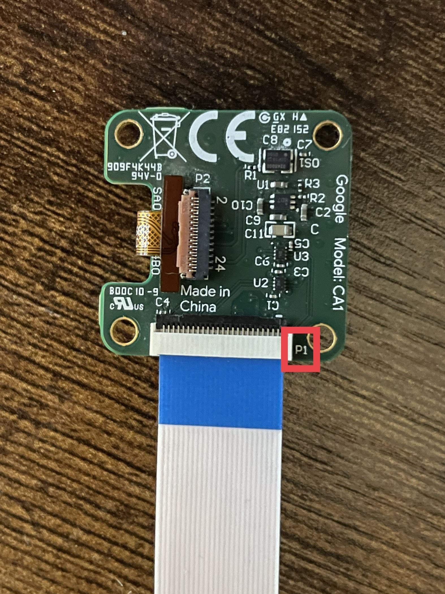
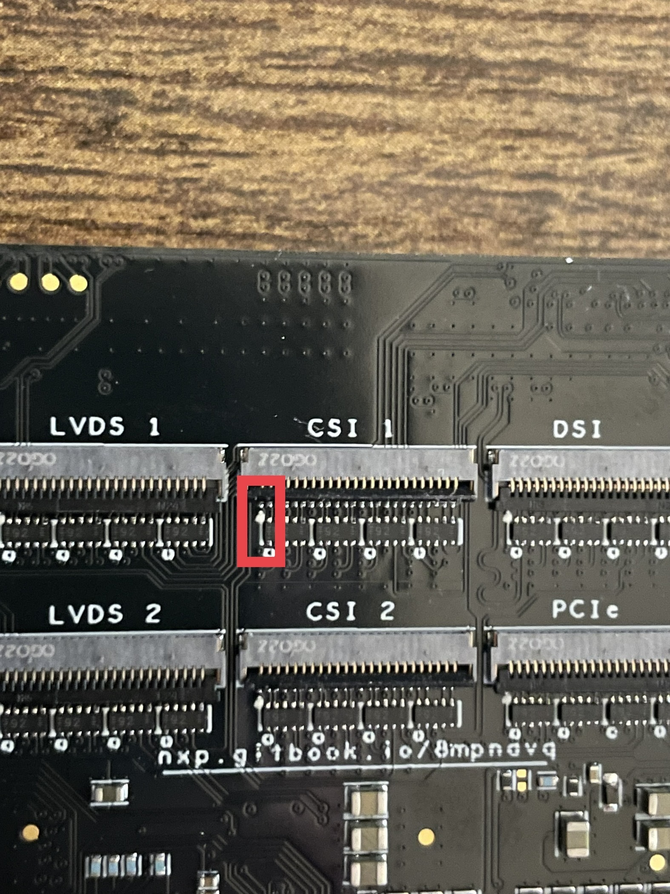

# MIPI CSI

## Connecting the Google Coral Camera

BEWARE! If the Google Coral Camera is connected backwards, it will cause a short circuit and burn out both the MIPI-CSI cable and the sensor in the camera. Please see the images below on how to properly connect the Google Coral Camera to the NavQ+.

Pin 1 (P1) on the Google Coral Camera should be connected to the pin with the arrow on the MIPI-CSI port. Please see the images below. The sides with the red box should line up. You should see the blue on the flex cable when connecting to the MIPI-CSI port.


Image reference of how the camera should be connected to the NavQ+. Please note the orientation of the flex cable. This is very important!


