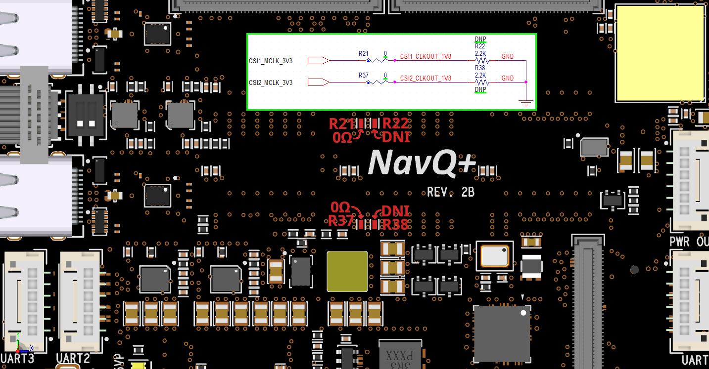

# MIPI-CSI interface RevA vs RevB rework

The pre-production version of the NavQPlus shipped with a Google Coral autofocus Camera based on OV5645 image sensor.

\
The Production "RevB version" of the NavQPlus makes a small adjustment to the MIPI CSI Clock line in order to be more compatible with a variety of image sensors. This is also the configuration used with the OV5645 fixed focus image sensors from Innowave that ship with the RevB board\
\
As shown in the image below, the resistors R21 and R37 shoudl be 0 Ohm (or solder jumpers) and the resistors R22 and R38 should be removed. (DNP/DNI)

&#x20;&#x20;

<figure><figcaption></figcaption></figure>
