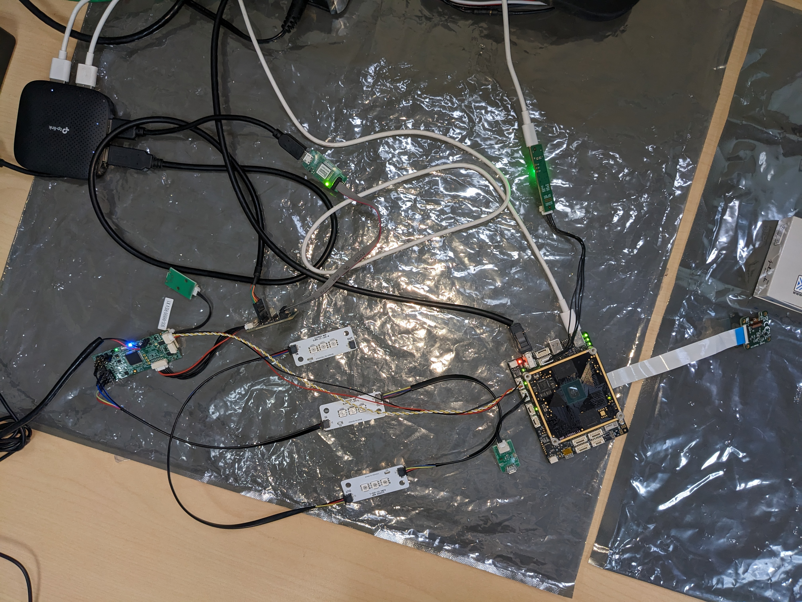
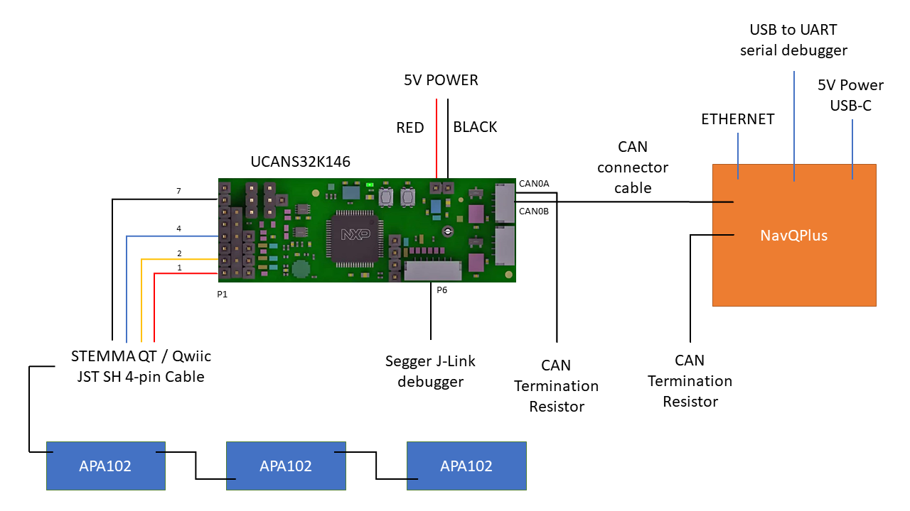
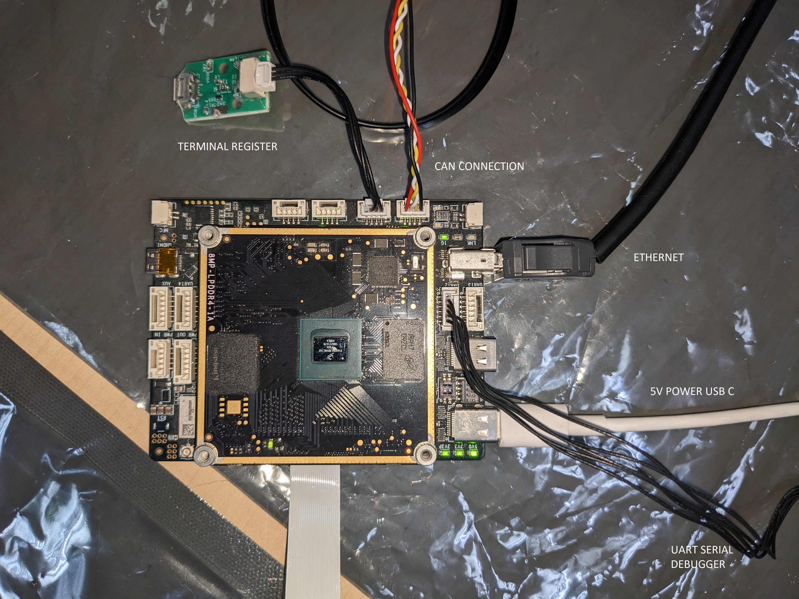

# Operate APA102 LED Board via ROS2 on NavQPlus over UCANS32K1 Board

## Introduction

This tutorial explains how to operate APA102 LED Board via NavQPlus with ROS2 over UCANS32K1 Board. NavQPlus and UCANS32K1 boards will communicate via CAN-FD. UCANS32K1 and APA102 boards will communicate via SPI.

## Items Needed

* NavQPlus Board
* USB-UART serial debugger cable
* 2 CAN Termination Resistor network
* CAN connector cable
* Micro SD Card
* An APA102 based RGB LED board&#x20;
* UCANS32K146 or UCANS32K1SIC
* Jumper wires
* STEMMA QT / Qwiic JST SH 4-pin Cable
* Segger J-Link debugger or similar debugger

## Hardware Procedure

<figure><figcaption><p>Complete Hardware Setup</p></figcaption></figure>

<figure><figcaption><p>Block Diagram</p></figcaption></figure>

### APA102 LED Board

Refer the 'connections' and 'network' for 3-LED APA102 Board [here](http://127.0.0.1:5000/s/-M7FJ\_hQKd8L0MNgduui/ucans32k1sic-demo-application/demo-apa102-rgb-led-control-via-ucans32k146-with-px4-autopilot#apa102-led-board).

Note: we will be using three 3-LED APA102 Boards in this tutorial, each containing three RGB LEDs. The boards will be connected in daisy-chain network.

### NavQPlus Board

<figure><figcaption><p>NavQPlus Connections</p></figcaption></figure>

### UCANS32K1 Board

<figure><figcaption><p>UCANS32K1 Connections</p></figcaption></figure>

## Software Procedure

### UCANS32K1

#### Software Setup

```
git clone -b pr-ucan-pca9685 https://github.com/px4/px4-autopilot.git --recursive PX4-Autopilot-pr-ucan-pca9685.
cd PX4-Autopilot-pr-ucan-pca9685
git pull
make nxp_ucans32k146_pca9685 menuconfig
```

Enable 'apa102 led' driver and 'apa102 led' example in the menu. Note: You may search for their location in the menu by typing / followed by the name of the option. Ex: "/apa102" + enter.

Change the value of 'NUM\_LEDS' macro  in 'examples/apa102/apa102\_main.c' to 3.

#### Building PX4

```
make nxp_ucans32k146_pca9685
    // output: build/nxp_ucans32k146_default/deploy/34.bin
```

Note: if you get error in the following line: snerr("ERROR: Each LED uses 4 bytes, so (buflen % 4)", apply the following patch in the 'platforms/nuttx/NuttX/nuttx' sub-directory.


unknown\_conversion\_type\_character patch


#### Flashing PX4

Note: You may flash the attached file (configured for a 3-LED APA102 board), to skip the above steps.


PX4 Firmware


```
// start jlink.exe.
connect
// specify the following:
    // device: s32k146;
    // target interface: s (which stands for swd);
    // interface speed: 1000 khz (recommended);
loadbin <path to 34.bin> 0x6000
// quit jlink tools by typing 'q'.
```

### NavQPlus

#### NavQPlus WIC Image Clone & Setup

Clone and extract 'navqplus-image-22.04-230127.wic.bz2' from [here](https://github.com/rudislabs/navqplus-create3-images/releases/tag/v22.04.2).

Flash the WIC image on the SD Card, using HxD.

* Set the [boot switches](../navqplus-user-guide/quickstart/additional-interface-details/flashing-with-new-firmware/flashing-with-new-firmware.md) on the NavQPlus Board to 'sdcard mode' (i.e. both switches should be on), then reset the board (by turning it off and on).
* Credentials:
  * username: user.
  * password: user.

#### Receive heartbeat from UCANS32K1

```
sudo ip link set can0 down
sudo ip link set can0 up type can bitrate 1000000 dbitrate 4000000 loopback off fd on fd-non-iso off restart-ms 100
```

Note: you may see the output using the 'ifconfig' command.

#### ROS2 Setup

```
mkdir -p ~/git/ros2/src
cd ~/git/ros2/src
git clone https://github.com/NXPHoverGames/ros2_orchestrator.git -b NavQPlusPX4Demo
```

Note: if you get 'server certificate verification failed', you may run 'git config --global http.sslverify false' to turn off this check, or add the necessary certificate to the trust store of your operating system. Please note that the former method is only for testing purposes.

Replace the config.json file in ros2\_orchestrator with the config.json attached below.


config.json


Set the 'max\_leds' parameter in config.json equal to the number of LEDs in your APA102 board.

<pre><code>cd ~/git/ros2
<strong>colcon build --symlink-install
</strong></code></pre>

Note: if you get 'clock skew' warning, running 'find . -type f | xargs -n 5 touch' should resolve it. Otherwise reset the system clock.

```
echo "source /home/user/git/ros2/install/setup.bash" >> ~/.bashrc
source ~/.bashrc
ros2 launch ros2_orchestrator orchestrate.launch.py
```

* Note: you may be prompted after successful execution to run further commands.
* ROS2 launcher may block the shell so you may need to open another shell via ssh on the ethernet ip to run your tests.
* If you get 'could not read from remote repository', replace 'git@' with 'https://' in clone links in config.json. also, replace ':' with '/'. ex: 'git@github.com:rudislabs/opencyphal\_led.git' would become 'https://github.com/rudislabs/opencyphal\_led.git'.
* If you get error related to usb0/mlan0 (which happens when these devices are not connected), comment out their tags in the '\~/CycloneDDSConfig.xml' file.

## Demonstration

Commands for publishing colors according to the number of leds in our setup: (Ex: we ran the command for 9-leds because we are using three 3-LED APA102 boards cascaded together.)

* 3-leds: ros2 topic pub /led\_image sensor\_msgs/msg/Image "{height: 1, width: 3, encoding: "rgb8", step: 9, data: \[61,255,0, 255,255,61, 255,61,127]}".
* 6-leds: ros2 topic pub /led\_image sensor\_msgs/msg/Image "{height: 1, width: 6, encoding: "rgb8", step: 18, data: \[0,0,255, 0,255,0, 255,0,0, 127,127,0, 127,0,127, 0,127,127]}".
* 9-leds: ros2 topic pub /led\_image sensor\_msgs/msg/Image "{height: 1, width: 9, encoding: "rgb8", step: 27, data: \[0,0,255, 0,255,0, 255,0,0, 127,127,0, 127,0,127, 0,127,127, 61,255,31, 255,31,61, 61,31,255]}".
* 12-leds: ros2 topic pub /led\_image sensor\_msgs/msg/Image "{height: 1, width: 12, encoding: "rgb8", step: 36, data: \[0,0,255, 0,255,0, 255,0,0, 128,128,0, 128,0,128, 0,128,128, 0,0,255, 0,255,0, 255,0,0, 128,128,0, 128,0,128, 0,128,128]}".

<figure><figcaption><p>Demo: Three 3-LED APA102 Daisy Chained</p></figcaption></figure>
