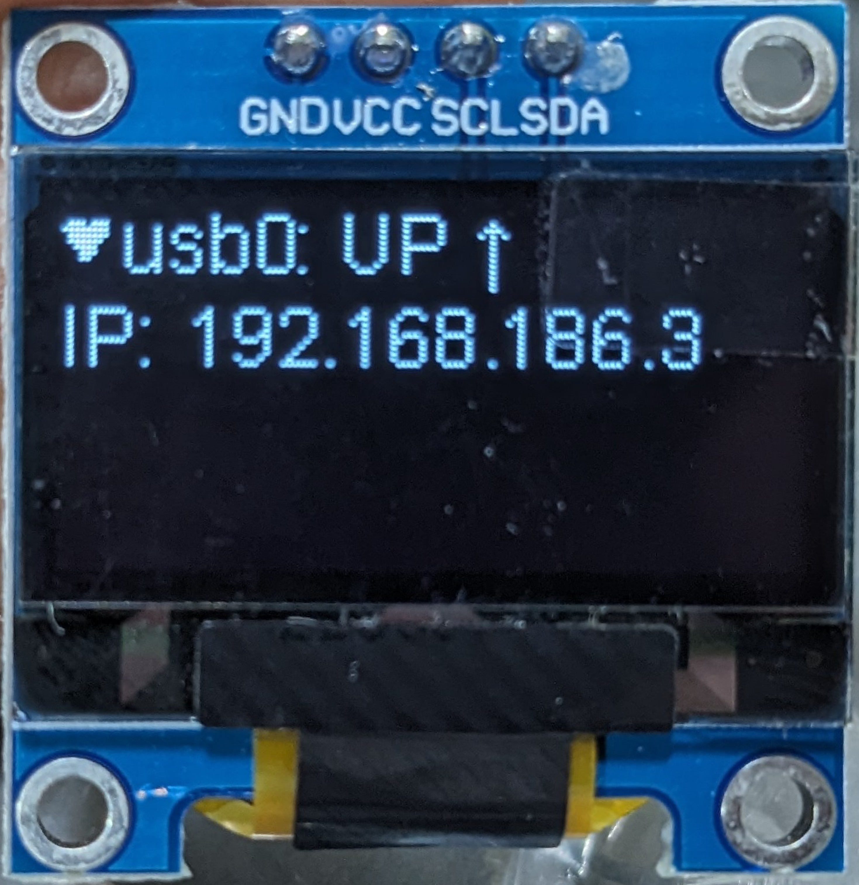

# Operate SSD1306 OLED via NavQPlus

## Introduction

This tutorial demonstrates how to write text on [SSD1306](https://cdn-shop.adafruit.com/datasheets/SSD1306.pdf) OLED display modules using the I2C interface of [NavQPlus](https://nxp.gitbook.io/navqplus/) board.

## Items needed

<table><thead><tr><th width="114.33333333333331" align="center">S. No.</th><th width="500">Name</th><th>Quantity</th></tr></thead><tbody><tr><td align="center">1</td><td><a href="https://nxp.gitbook.io/navqplus/">NavQPlus</a></td><td>1</td></tr><tr><td align="center">2</td><td>Micro SD Card (only for normal NavQPlus software image)</td><td>1</td></tr><tr><td align="center">3</td><td>USB-UART serial debugger</td><td>1</td></tr><tr><td align="center">4</td><td><a href="https://probots.co.in/usb-to-serial-converter-adapter-module-with-ttl-ftdi-cable-6-pins.html">USB-A (Male) to TTL 6-Pin Serial Adaptor Cable (Female)</a></td><td>1</td></tr><tr><td align="center">5</td><td><a href="https://thinklucid.com/product/ix-industrial-ethernet-cat6a-cable-2-0m-black/">Cat6a (Male) ix Industrial to RJ45 (Male) Ethernet Cable</a></td><td>1</td></tr><tr><td align="center">6</td><td><a href="https://www.apple.com/shop/product/HN892ZM/A/mophie-usb-a-cable-with-usb-c-connector-1-m">USB-C (Male) to USB-A (Male) Cable</a></td><td>1</td></tr><tr><td align="center">7</td><td>SSD1306 OLED (Preferrably 128×64 or 128×32)</td><td>1</td></tr><tr><td align="center">8</td><td><a href="https://www.adafruit.com/product/5754">JST GH 1.25mm Pitch 6 Pin Cable</a> (Female to Female)</td><td>2</td></tr><tr><td align="center">9</td><td>Jumper wires</td><td>4</td></tr></tbody></table>

## Hardware procedure


You will need to create a custom cable to connect the OLED 4 pin signals to a JST-GH 6 pin connector to plug into the NavQPlus.\
An off the shelf cable is not provided, but it is simple to make your own according to the table below.


### Connections from SSD1306 OLED to J12 Port on NavQPlus

<table><thead><tr><th width="196" align="center">OLED pin header #</th><th width="188">Name</th><th>JST-GH 6 Pin number of J12 on NavQPlus</th></tr></thead><tbody><tr><td align="center">1</td><td>Voltage</td><td>1</td></tr><tr><td align="center">2</td><td>Ground</td><td>6</td></tr><tr><td align="center">3</td><td>Clock</td><td>3</td></tr><tr><td align="center">4</td><td>SDA</td><td>2</td></tr></tbody></table>


<figure><figcaption><p>Block diagram of the complete setup</p></figcaption></figure>

## Software procedure

### Overview

In this example software, a daemon service polls the desired network interface every one second for its link status and ip address and publishes the same on an OLED display.

Any of the standard network interfaces may be specified when starting the daemon.

### Prerequisites

If not already running the standard NavQPlus ubunutu POC image, then flash the following image on the micro sd card of NavQPlus: [Ubuntu 22.04 for NavQPlus](https://github.com/rudislabs/navqplus-create3-images/releases) or greater. Click on the desired image and download the "[.](https://github.com/rudislabs/navqplus-create3-images/releases/download/v22.04.2/navqplus-image-22.04-230127.wic.bz2)wic.bz2" file. Extract it and flash the resultant ".wic" image on the micro sd card. More detailed instructions are [provided elsewhere in this gitbook](../navqplus-user-guide/quickstart/flashing-with-new-firmware.md).


### NavQPlus board setup

#### Install python libraries

_**On the NavQPlus board**_**,** install the python packages [`luma`](https://pypi.org/project/luma.oled/) and [`pillow`](https://pypi.org/project/Pillow/). They are required as prerequisites by our application. They are a driver for the OLED and also a small python imaging library.&#x20;

Perform the following steps to clone the project and set-up the application.


```
sudo pip install smbus2 luma.oled luma.core pillow  # installing prerequisites.

cd ~
git clone git@github.com:NXPHoverGames/NavQPlus-apps.git  # cloning the repo.
cd NavQPlus-apps/ssd1306_oled
```



Review the python code directly in the Git repo here:\
[https://github.com/NXPHoverGames/NavQPlus-apps](https://github.com/NXPHoverGames/NavQPlus-apps)


### Create Daemon

Create a daemon service that will invoke our application in the background, by running the following steps. The command "systemctl start" starts a new instance of the application in the background,, "systemctl status" returns the running status and latest logs of the said instance of the application and "systemctl stop" terminates the said instance of the daemon service.


To access the service using "systemctl status" and "systemctl stop" commands, the parameters must be the same as the ones used to start the service. (using "systemctl start"). &#x20;

Otherwise a different instance (the one corresponding to the passed parameters) of the service will be accessed.



```
sudo mv ssd1306_interface_status@.service /etc/systemd/system
sudo systemctl daemon-reload

sudo systemctl start $(systemd-escape --template ssd1306_interface_status@.service "<interface> <display width> <display height>")

sudo systemctl status $(systemd-escape --template ssd1306_interface_status@.service "<interface> <display width> <display height>")
```



This example python code does include a check whereby if the Daemon attempts to write to a non existent OLED, then the write command will fail and the daemon will stop itself automatically.&#x20;


#### Example 1: 128x64 OLED display

if you want to track the "usb0" interface and the resolution of your OLED module is 128×64 as that of the OLED in the image titled "Display B: SSD1306 128×64" in the demonstration section, then you may run the following command.

<pre data-overflow="wrap" data-line-numbers><code><strong>sudo systemctl start $(systemd-escape --template ssd1306_interface_status@.service "usb0 128 64")
</strong></code></pre>

####

#### Example 2: 128x32 OLED display

If you want to track the "usb0" interface and the resolution of your OLED module is 128×32 as that of the OLED in the image titled "Display A: SSD1306 128×32" in the demonstration section, then you may run the following command.


```
sudo systemctl start $(systemd-escape --template ssd1306_interface_status@.service "usb0 128 32")
```


#### Stopping the interface


To change interface name, display width and/or display height, or stop the service, run the following "systemctl stop" command,&#x20;

then (optionally) restart the service using the above "systemctl start" command with the new parameters.

This would normally only be required when you want to track a different network interface, or if you want to use an OLED module that has a different resolution than the one you were using before.



```
sudo systemctl stop  $(systemd-escape --template ssd1306_interface_status@.service "<interface> <display width> <display height>")
```


##

## Demonstration

Our application prints the link status and ip address of the specified network every one second on the SSD1306 OLED display. To change the link status of the network interface to UP or DOWN, you may use the following ifconfig commands. Note: when the link status is DOWN, the ip address is shown as NULL.

```
sudo ifconfig <interface name> up
sudo ifconfig <interface name> down
```


If the text is not displayed on the OLED screen, please retry after 5-10 seconds.


\<TODO> Update video below with youtube link

[Demonstration Video](https://nxp1-my.sharepoint.com/:v:/g/personal/mayankmahajan\_x\_nxp\_com/EUtcmK1Y2f9CrAjmbfSkXdgBPfZTOBRwYcHrVgMY26gITQ)

<figure><figcaption><p>Display A: SSD1306 128×32</p></figcaption></figure>

<figure><figcaption><p>Display B: SSD1306 128×64</p></figcaption></figure>
