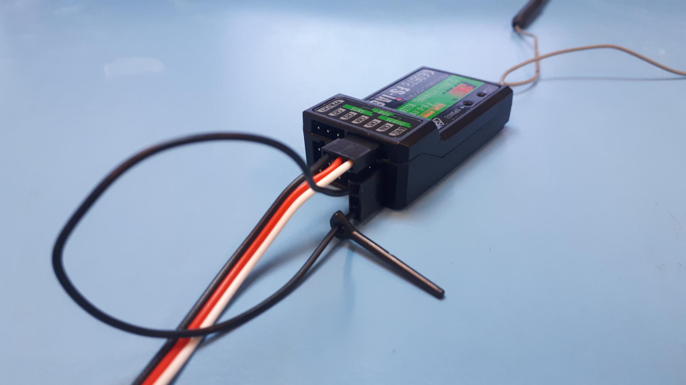

# Remote control setup

## Introduction

An RC remote control can be made to connect directly to the NavQPlus in order to transmit joystick and switch settings information. This can be then used in other software (ROS2) as input to control aspects of a vehicle directly or indirectly, such as reading an RC channel as an "arming switch". Note that this method uses a USB-UART adapter to facilitate the connection, but technically it is possible to create a direct serial connection.


There may be more than one way to attach an RC remote to the NavQPlus and in general to a robotics vehicle. Reminder that It may be preferable to attach an RC remote to an MCU board acting as a real time controller, such as MR-CANHUBK344 or MR-VMU-RT1776, at a lower level and have communication from that board go "up" to the NavQPlus &#x20;


## Requirements:

* FlySky FS-i6S RC transmitter
* FS-i6B receiver
* NavQPlus baseboard with Ubuntu image release 22.04.3 or above
* FTDI type USB-UART cable/adapter


For more information about configuring the FlySky FS-i6S transmitter, please refer to this [link](https://nxp.gitbook.io/hovergames/userguide/radio-controller-setup).


## Wiring

Connect the FS-i6B receiver to NavQPlus using TTL-UART cable (you need to prepare this cable yourself).

Connect the cable to a general use UART connector (the board is equipped with 4 connectors, three of them are available for general use. (Note UART1 is assigned internally to communicate with the Bluetooth portion of the WiFi/BT Wireless module on the NavQPlus Baseboard). Check this [page](https://nxp.gitbook.io/8mpnavq/dev-guide/hardware-interfaces/uart) for more details.

Connect the three TTL wires Black/Red/White to the FS-i6B receiver as depicted in the picture below:

<figure><figcaption><p>FS-i6B receiver</p></figcaption></figure>

After plugging the receiver to NavQPlus board, you should see a red LED blinking in the receiver. If your transmitter is already on, it should bind automatically to the receiver otherwise you can bind it manually under its system menu. After binding, the red LED should be constantly glowing.


RC Binding is simply the process to assign an RC Receiver to the RC transmitter. It is covered in the FlySky documentation. Generally you put the TX in "bind mode"  and then power up the RX with a jumer across the bind pins.


## Software setup


The `fsia6b` driver is integrated since the Ubuntu [release 22.04.3](https://github.com/rudislabs/navqplus-create3-images/releases/tag/v22.04.3), so you need at least this version in order to run the setup.&#x20;


Under NavQPlus linux console, run the following command in the background in order to create a new joystick input device:

```
sudo inputattach --fsia6b /dev/ttymxc2 &
```

Now your receiver is attached, you can use it for your need  (ROS, software simulation, ...)

In order to check it is detected properly, run _**jstest-gtk**_ software.

The new controller should show up as "FS-iA6B iBus RC receiver". The bar graphs should change accordingly when you move the control sticks.
