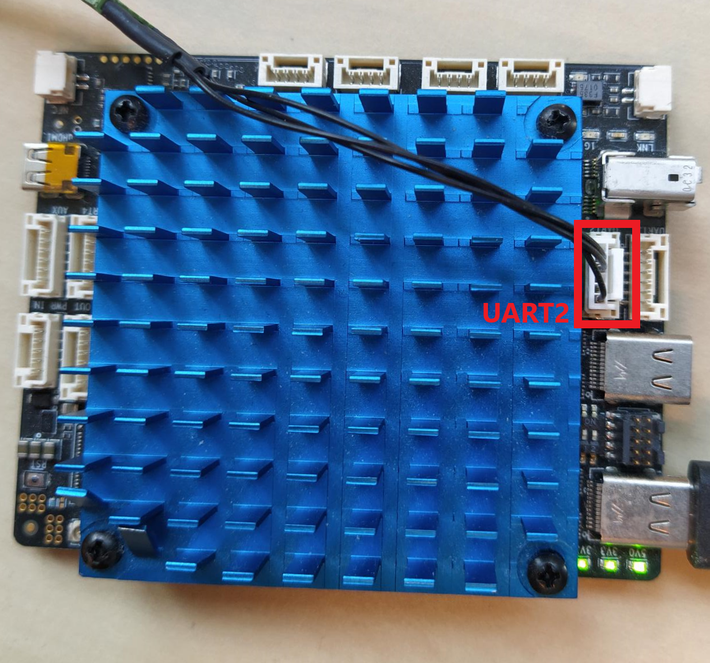

# Quick start guide

Following these 8 steps, you will be able to start using the NavQPlus in no time. When needed, more information is available in the [detailed instructions](quickstart/) chapter. Also checkout the [TurtleBot4 / iRobot Create3 documentation](turtlebot4-irobot-create3.md), and the other parts of this GitBook.

## 1. Download an Ubuntu image

Download the latest Ubuntu image for NavQPlus (in .wic file format) from GitHub:

* For use with iRobot Create3 (AKA Turtlebot4)



* For use with NXP MR-B3RB



##

## 2. Download the UUU tool

uuu is an NXP command line tool that runs on a PC and can commnicate directly with the MPU on the NavQPlus. To flash the eMMC memory on your NavQPlus (next step), you will also need to download the uuu tool ("Universal Update Utility"). \
\
Download the latest release from GitHub:&#x20;



Make sure to download the correct application for your platform. The .exe file is a Windows executable. The file named "uuu" without extension is a x86/64 Linux binary.

## 3. Set the boot switches to flash mode

Before plugging in the board, find the [boot switches](quickstart/flashing-with-new-firmware/flashing-with-new-firmware.md) on your NavQPlus and flip them to the "flash" mode. See the table and picture below for reference.

<table><thead><tr><th width="127">Mode </th><th width="142">Switch 1</th><th>Switch 2</th></tr></thead><tbody><tr><td>SD </td><td>ON </td><td>ON </td></tr><tr><td>eMMC </td><td>OFF </td><td>ON </td></tr><tr><td><em><strong>Flash</strong></em> </td><td><em><strong>ON</strong></em> </td><td><em><strong>OFF</strong></em> </td></tr></tbody></table>

<figure><figcaption></figcaption></figure>

## 4. Flash the eMMC memory&#x20;

The NavQPlus firmware is preferably installed on eMMC memory for reliability reasons, even though it may be convenient during development to use the SD card. Especially if you are flying a drone, vibrations may cause (occassional) failure of the physical connections to an SD card.&#x20;

Connect the NavQPlus to your computer using the leftmost USB-C port (USB 1). The two status LEDs should light up as shown above.

Open a command line window. Run the following command to check that the NavQPlus is recognized by UUU:&#x20;


Make sure to be in the correct directory where the UUU file is located and the image file. Otherwise, you must add the path to the file.&#x20;



```bash
./uuu -lsusb
```



```bash
./uuu.exe -lsusb
```


<figure><figcaption></figcaption></figure>

You should see that there is a device detected. To flash your board, use the command below (adapt the filename/version to match the image file that you downloaded in step 1):&#x20;


```bash
.uuu -b emmc_all navqplus-image-<version>.wic 
```



```bash
.uuu.exe -b emmc_all navqplus-image-<version>.wic 
```


Once this process has finished, make sure that the flash process was successful by comparing the program output to the image below.

<figure><figcaption></figcaption></figure>

## 5. Set the boot switches to eMMC mode

You should now (again) change the [boot switches](setup-guide-emmc.md#boot-switches) to boot from eMMC (also see step 3).

<table><thead><tr><th width="127">Mode </th><th width="142">Switch 1</th><th>Switch 2</th></tr></thead><tbody><tr><td>SD </td><td>ON </td><td>ON </td></tr><tr><td><em><strong>eMMC</strong></em> </td><td><em><strong>OFF</strong></em> </td><td><em><strong>ON</strong></em> </td></tr><tr><td>Flash </td><td>ON </td><td>OFF </td></tr></tbody></table>

## 6. Log in for the first time&#x20;

Power on the NavQPlus by plugging in a USB-C cable to the centermost USB-C port (USB2). Make sure to provide enough power (a >5W supply is recommended). The NavQPlus will boot, and you will be able to confirm it has fully booted by observing the LEDs on board. The three LEDs by the USB1 port should all be on, as well as two LEDs next to the CAN bus connectors.&#x20;

To log into NavQPlus for the first time, you can either use the included USB to UART adapter, ethernet, or USB gadget mode.&#x20;

### USB to UART adapter

Connect the included USB to UART adapter to the UART2 port on the NavQPlus, and open your favorite serial console application (e.g. PuTTy for Windows users, Minicom on Linux). Open a serial console and set the baud rate to 115200. If there is no output on the screen, try to press enter to get a log-in prompt.

<figure><figcaption></figcaption></figure>

If the boot was successful, in the terminal it will ask for the username and then the password. The default username/password is as follows:&#x20;

```
Username: user 
Password: user 
```

At this point you can start playing around already with the NavQPlus. However, it is recommended to also follow the last steps.

### Ethernet <a href="#ethernet" id="ethernet"></a>

To connect to the board over ethernet, connect the included ix Industrial ethernet cable to NavQPlus, and connect the RJ45 connector to your computer, switch, or router on your local network. You can log into NavQPlus over SSH. More information on this setup is explained in the [Ethernet page](quickstart/ethernet-over-usbc-gadget-mode.md). The default hostname for NavQPlus is imx8mpnavq or use the IP adress from your board instead. To SSH into NavQPlus, you can run the following command:

```
ssh user@imx8mpnavq.local
```

It will also ask the password after a successful connection to your board. As mentioned above the default password is _**user**_.

### USB Gadget Ethernet <a href="#usb-c-gadget-ethernet" id="usb-c-gadget-ethernet"></a>

The IP address of the `usb0` network interface on NavQPlus is statically assigned to 192.168.186.3. If you want to use USB gadget ethernet to connect to NavQPlus, you will need to assign a static IP to your existing gadget ethernet interface on your computer.&#x20;

First go to your network settings and click on the plus icon on the top right.

<figure><figcaption></figcaption></figure>

The network configuration is as follows:

**IP Address:** 192.168.186.2

**Network Mask:** 255.255.255.0


Once you have set up your USB-C gadget ethernet interface on your computer, you can SSH by running:

```
ssh user@imx8mpnavq.local
```

## 7. Expand Image (if needed/desired)&#x20;


Note that this step of expanding the image  is currently not used with MR-B3RB image version


The flashed images MAY need expanding to utilize all the available storage. After logging into the NavQPlus, open a terminal and run:

* Expand image on the eMMC memory (if you followed the instructions above):


```
echo -e "d\n2\nn\np\n2\n196608\n\n\nw" | sudo fdisk /dev/mmcblk2 && sudo resize2fs /dev/mmcblk2p2 
```


* Expand image on the SD card (if you chose to flash the image on the SD card):&#x20;


```
echo -e "d\n2\nn\np\n2\n196608\n\n\nw" | sudo fdisk /dev/mmcblk1 && sudo resize2fs /dev/mmcblk1p2 
```


## 8. Change the default username and password <a href="#configuring-wifi-system-username-and-password" id="configuring-wifi-system-username-and-password"></a>

To change the default username and password, use the commands below.

Username (replace \<new\_username> with your desired username):

```
usermod -l <new_username> user
mv /home/user /home/<new_username>
```

Password (you will be prompted to enter the current and new password):

```
passwd
```

## What's Next?

Now with the NavQPlus setup complete, you can start to install other software packages and run your own code. For example, [ROS2](software/ros2/) (Robot Operating System) is commonly used as a framework for controlling robotic systems, with plenty of compatible packages being available.
